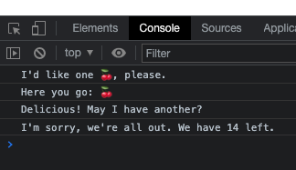

A simple React Module exercise.

To run, download the files and then, in terminal:
```shell
npm start
```

To view the results, open the console in browser. The result should be as follows:
```console
I'd like one [RANDOMFRUIT], please.
Here you go: [RANDOMFRUIT]
Delicious! May I have another?
I'm sorry, we're all out. We have 14 left.
```


Inside `/src`, there are 2 helper functions inside `helpers.js`:
```jsx
choice(item) // selects a random choice from array
remove(items, item) // removes an item from an array of items
```

These are then imported into `index.js` and used as variables to `console.log` the desired output above.
